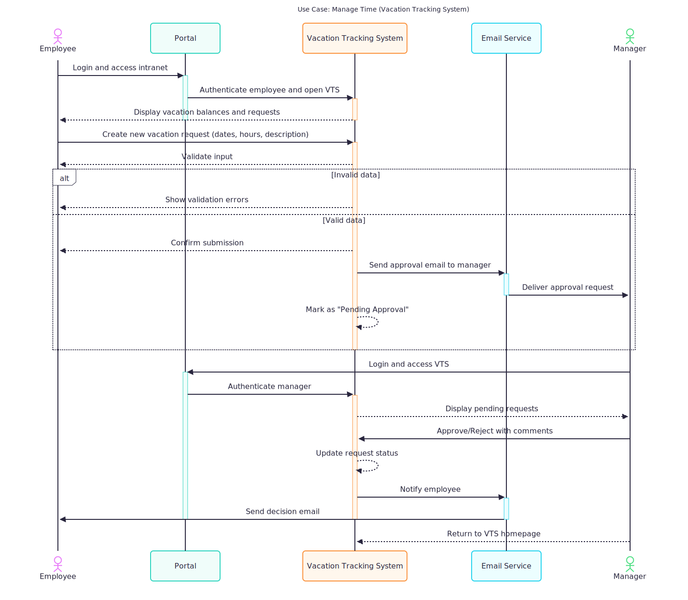
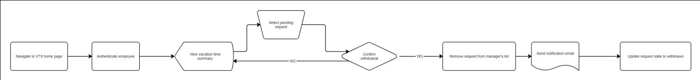
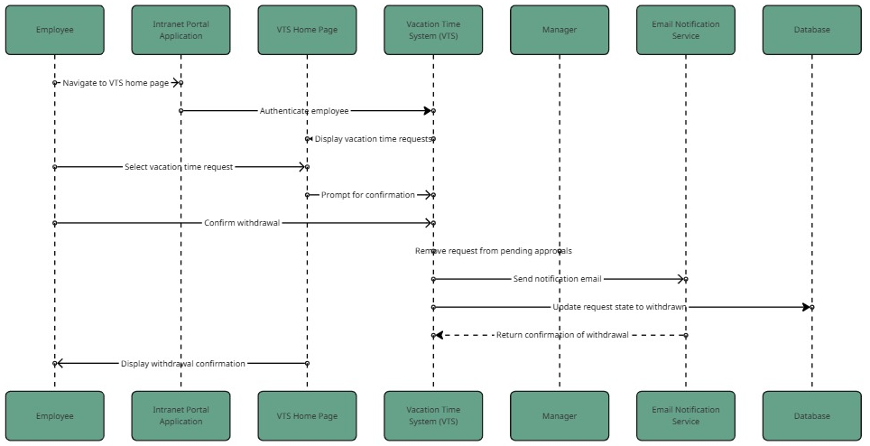
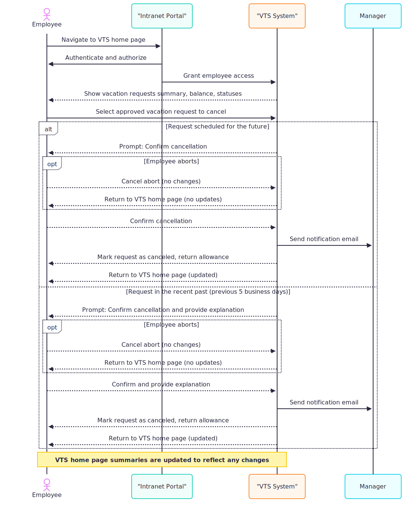
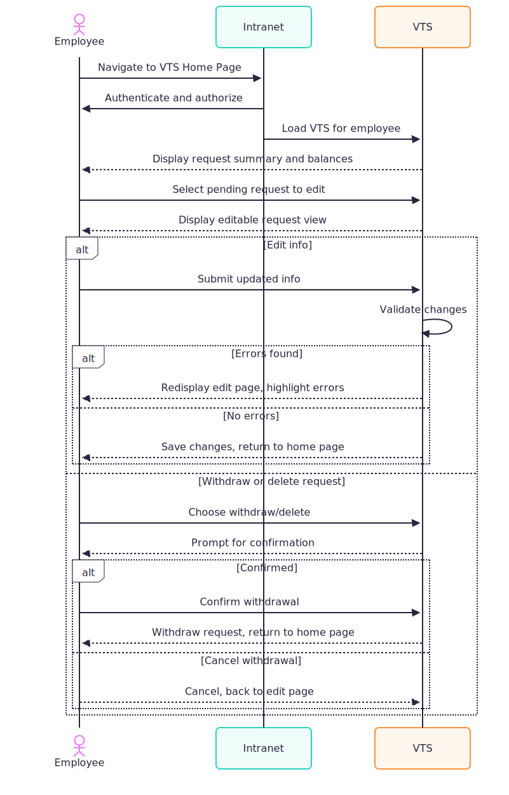

# **Vacation tracking system**

## 1. ***Requirements***

### -  **Vision**
  the VTS (Vacation Tracking System) aims to to provide all the employees with direct control on managing their vacations, sick leave by sumiting, updating, viewing their reqests through an easy to use platform, without having to be aware of the company policies or sending manual requests to the HR department and waiting for managers to proccess them. this platform redueces delays and lessen the HR work. it saves time for the company, improves communication, and provides a history for old requests.

### - **Functions**

  - the system should allow employees to view, edit, cancel or create vacation requests  
  - the system should notify HRs and request approval for employees requests 
  - the system should should allow HRs and managers to update users vacation bundle 
  - the system should allow employees to make requests up to 1.5 years in the future, and view old requests 
  - the system should email the manager to request approval and notify the employee with their status 
  - the system shouldn't allow requests to be made if the vacation bundle is exceeded
  - the system should allow HRs and managers to override all actions restricted by rules

### - **Non-Functions**
  - Is implemented as an extension to the existing intranet portal system, and uses the portal’s single-sign-on mechanisms for all authentication
  - the system should be easy to use 
  - the system should have a clean UI and responsive on all screen sizes
  - the system should generate logs for accetped, rejected, cancled requests
  - the system should log HRs override actions

### - **Constraints**
  - the platform should only be accessible by the company intranet
  - the system should run on the company existing infrastructure 


## 2. **Domain**
  the domain of our application is in Human Resources (HR), specifcally the Vacation managment domain which includes handling vacation bundles, awarded vacations, approving and rejection requests

## 3. **Actors**
###  the actors for this application are the following:
  - Employees
  - Clerk (HR)
  - Manager
  - System
## 1. Use Case: Manage Time:-
## 1.1 **FlowChart** 


## 1.2 **Sequence Diagram**


## 1.3 **Pseudo Code (js flavored)**
``` js
  const manageTime = () => {
    const isAuthenticated = authenticateEmployee();
    if (isAuthenticated) {
      displayBalance();
    }
    const makeRequest = () => {
      const validRequest = validateRequest();
      if (validRequest) {
        sendApprovalEmailToManager();
      }
    };
    if (managerIsAuthenticated) {
      displayPendingRequests();
      sendResponseToEmployees();
      redirectToVTSHomePage();
    }
  };
```
## 2. Use Case: Withdraw Request:-
## 2.1 **Flow Chart**


## 2.2 **Sequence Diagram**

## 2.3 **Psuedo Code**
``` js
const withdrawRequest = (requestId) => {
  const isAuthenticated = authenticateEmployee();
  if (!isAuthenticated) return redirectToLogin();

  const request = getRequestById(requestId);
  if (request.status !== 'pending') {
    return displayError("Only pending requests can be withdrawn");
  }

  const confirmWithdraw = confirm("Do you really want to withdraw this request?");
  if (confirmWithdraw) {
    request.status = 'withdrawn';
    notifyManager(requestId, 'withdrawn');
    updateRequest(requestId, request);
    return redirectToVTSHomePage();
  }
};
```

## 3. Use Case: cancel Request:-
## 3.1 **Flow Chart**


## 3.2 **Sequence Diagram**

## 3.3 **Pseudo code**
``` js
const cancelRequest = (requestId) => {
  const isAuthenticated = authenticateEmployee();
  if (!isAuthenticated) return redirectToLogin();

  const request = getRequestById(requestId);
  if (request.status !== 'approved') {
    return displayError("Only approved requests can be canceled");
  }

  const confirmCancel = confirm(
    request.date > today() 
      ? "Do you really want to cancel this future request?" 
      : "Do you want to cancel this recent past request? Please provide a short explanation."
  );

  if (confirmCancel) {
    if (request.date <= today() && !getCancellationReason()) {
      return displayError("Explanation is required to cancel recent past requests");
    }

    request.status = 'canceled';
    restoreVacationBalance(request);
    notifyManager(requestId, 'canceled');
    updateRequest(requestId, request);
    return redirectToVTSHomePage();
  }
};
```
## 4. Use Case: Edit Request:

## 4.1 **Flow Chart**


## 4.2 **Sequence Diagram**


## 4.3 **Psuedo Code**
``` js
// Edit Pending Request
const editPendingRequest = (requestId) => {
  const isAuthenticated = authenticateEmployee();
  if (!isAuthenticated) return redirectToLogin();

  const request = getRequestById(requestId);

  if (request.status !== 'pending') {
    return displayError("Only pending requests can be edited");
  }

  displayEditableRequest(request);

  const changes = getEmployeeChanges();
  if (changes.withdraw) {
    const confirmWithdraw = confirm("Do you really want to withdraw this request?");
    if (confirmWithdraw) {
      withdrawRequest(requestId);
      notifyManager(requestId, 'withdrawn');
      return redirectToVTSHomePage();
    }
  } else {
    const validChanges = validateRequestChanges(changes);
    if (validChanges) {
      updateRequest(requestId, changes);
      return redirectToVTSHomePage();
    } else {
      return displayErrors(validChanges.errors);
    }
  }
};
```
## **ERD**

